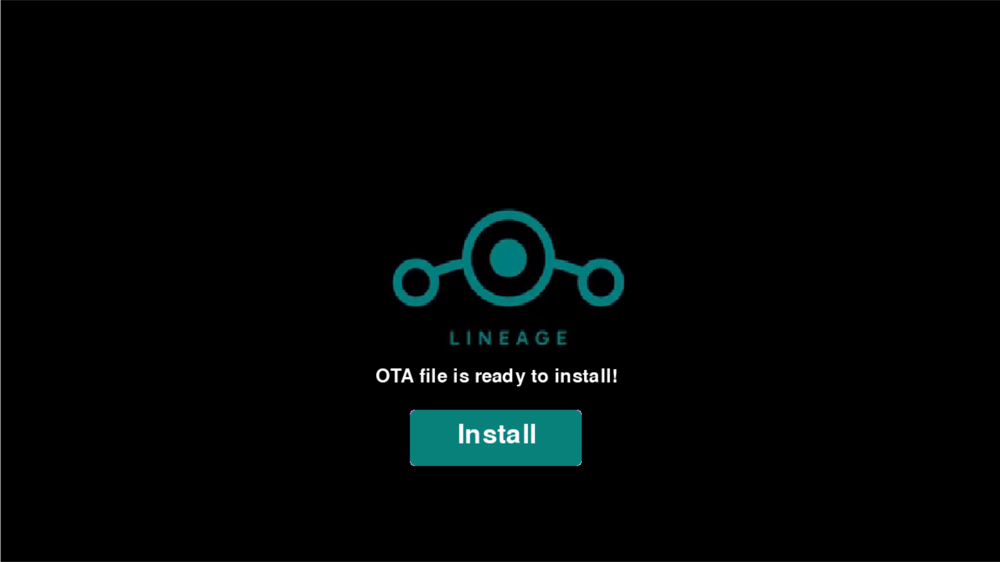
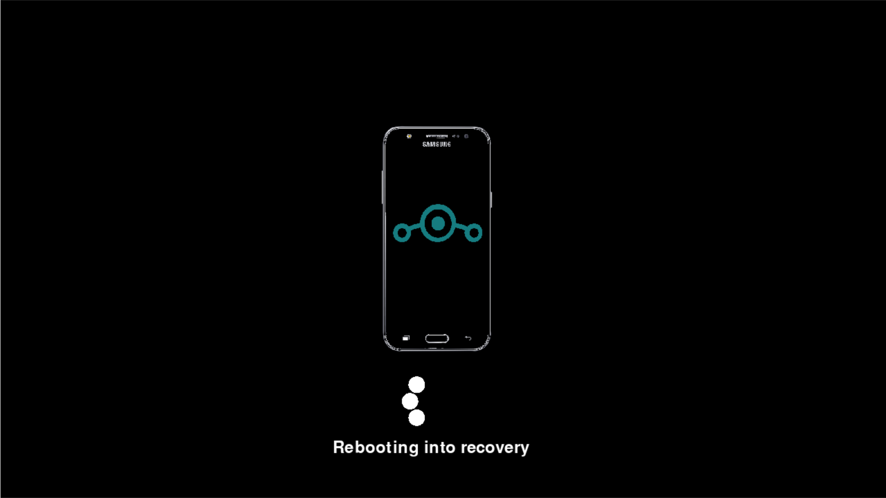

  <br/>

Desktop UI for downloading and installing latest OTA updates for your J5 device

 
<br/>

# Screens






<br/>


# Installation

```GNU/Linux ```
```
git clone https://github.com/daviiid99/Galaxy_J5_Downloader.git Galaxy_J5_Downloader
cd Galaxy_J5_Downloader
python3 main.py
```
<br/>

``` Microsoft Windows```
```
git clone https://github.com/daviiid99/Galaxy_J5_Downloader.git Galaxy_J5_Downloader
cd Galaxy_J5_Downloader
python main.py
```
